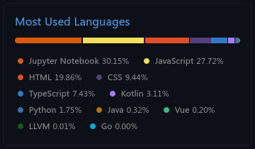

---

    

        - 🔭 I’m currently working on IoT Projects
        - 🌱 I’m currently learning Python and C
        - 👯 I’m looking to collaborate on Mechatronic Projects
        - 🤔 I’m looking for help with Machine Learning
        - 💬 Ask me about Arduino and ESP ideas
        - 📫 How to reach me: projects.appjavadev@gmail.com
    

    

        
    

---

