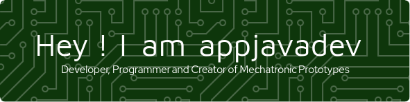
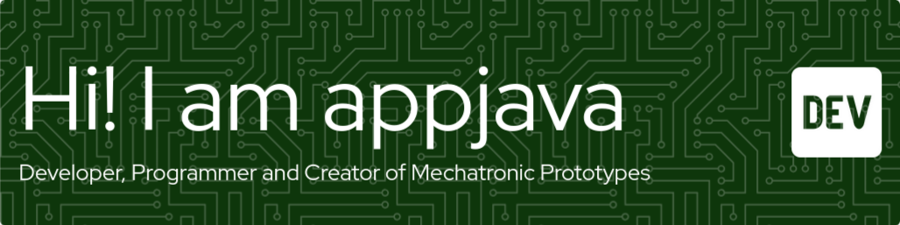

<!---->

</img>
<!--## Hi there 👋-->
---

- 🔭 I’m currently working on IoT Projects
- 🌱 I’m currently learning Python and C
- 👯 I’m looking to collaborate on Mechatronic Projects
- 🤔 I’m looking for help with Machine Learning
- 💬 Ask me about Arduino and ESP ideas
- 📫 How to reach me: projects.appjavadev@gmail.com

---

</img>
